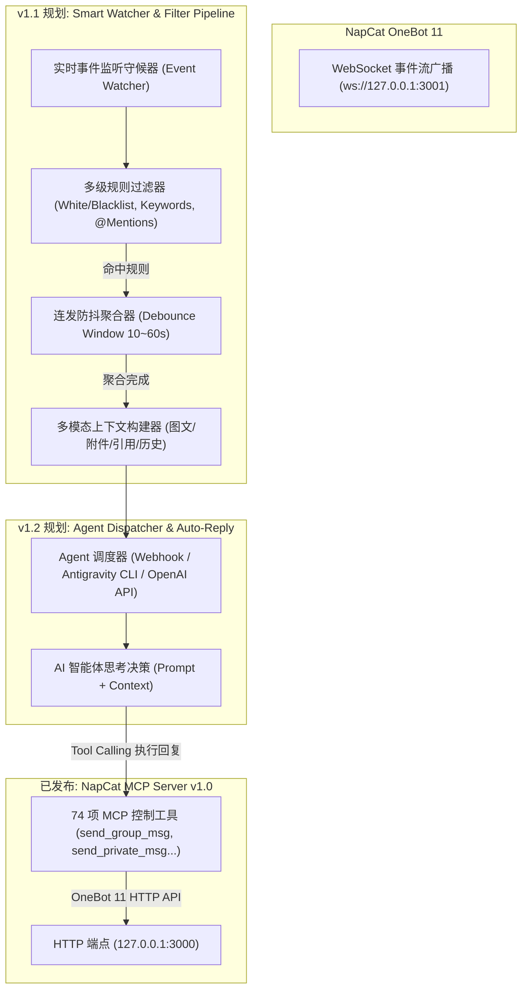

# 🗺️ OmniQQ-MCP 架构演进与下一步更新路线图 (Roadmap)

本文档详细阐述 **OmniQQ-MCP** 在完成第一阶段（74 项全量控制工具 + 万能透传 + 二维码登录与多账号热切换 + 环境自运维）后的下一步核心功能规划：**实时消息监听、多级智能筛选与自动唤醒 AI 应答闭环引擎 (Smart Message Watcher & Agent Auto-Reply Pipeline)**。

---

## 1. 设计哲学：机制与策略彻底解耦

在传统的 QQ Bot 开发中，通信、业务逻辑与 AI 提示词往往紧密揉杂在一起，导致改动规则需要频繁重启整个服务。

OmniQQ-MCP 坚决贯彻 **“机制与策略分离” (Separation of Mechanism & Policy)**：
* **MCP Server（机制层，已发布 v1.0）**：专注于提供标准、纯净、高可用的 QQ 控制武器库（发消息、传文件、踢人、改名片、查历史、扫码登录）；
* **Auto-Reply Pipeline（策略层，v1.1 ~ v1.2 规划）**：以伴生守候器（Sidecar / Event Watcher）的形式运行，负责实时收信、多级过滤与唤醒 AI。



---

## 2. 详细功能规划与模块拆解

### 阶段一：实时消息智能监听与多维筛选引擎 (v1.1)

#### 2.1 多维规则过滤器 (Filter Pipeline)
提供声明式配置（YAML / JSON），支持对接收到的 QQ 消息做毫秒级过滤：
* **目标白名单 / 黑名单过滤**：
  * 支持指定私聊 QQ 号列表（如仅监听特定好友、主管、特定学生）；
  * 支持指定群聊群号列表（如仅监听工作群、班级大群、专项活动群）；
* **触发机制匹配**：
  * `@全体成员` 或 `@当前机器人` 强提醒捕获；
  * 正则表达式与关键词触发（如匹配 `请假`、`通知`、`开会`、`汇总` 等意图词）；
  * 支持“私聊全放行，群聊仅响应 @我”等自适应规则；
* **事件类型扩展**：
  * 不仅支持普通文本，还能监听**群文件上传事件**、**好友/加群验证请求事件**并触发 AI 预处理。

#### 2.2 连发防抖与多模态消息聚合 (Debounce Aggregator)
真人发 QQ 往往习惯“连续发多条短句”，并夹杂图片或表格附件。如果每来一条就立刻请求大模型，不仅导致语义支离破碎，还会严重消耗 Token：
* **动态防抖窗口 (Debounce Window)**：
  * 默认设定 10~30 秒防抖保护时间；
  * 当检测到同一发送者在窗口期内持续打字/发送时，自动重置计时器并将其静默归入暂存包（Bundle）；
* **富媒体聚合打包**：
  * 将多条文本、表情、图片 URL、本地下载的文件附件路径合并为一个完整的结构化上下文，一次性投递给大模型。

---

### 阶段二：Agent 自动调度与闭环应答 (v1.2)

#### 2.3 智能体驱动接口 (Agent Loop Dispatcher)
支持主流的 Agent 宿主唤醒方案：
1. **Antigravity 原生生态集成**：
   * 调用本地 `agentapi` 或消息路由系统自动开启独立会话，注入聚合后的消息上下文，由宿主 AI 处理；
2. **通用 OpenAI / Anthropic 兼容 Webhook**：
   * 将聚合消息直接转发给自建的 LangChain、LlamaIndex、AutoGPT 或 Dify 工作流；
3. **本地 Python 回调插槽**：
   * 允许开发者直接通过纯 Python 代码编写自定义应答逻辑：
     ```python
     from napcat_mcp.watcher import on_message

     @on_message(groups=[123456], at_me=True)
     async def handle_group_question(bundle, client):
         reply_text = await my_llm.generate(bundle.clean_text)
         await client.call_api("send_group_msg", {
             "group_id": bundle.group_id,
             "message": f"[CQ:at,qq={bundle.user_id}] {reply_text}"
         })
     ```

#### 2.4 人机协同与二道审批门禁 (Human-in-the-Loop)
对于敏感群聊（如班级年级大群、工作业务群）：
* 支持开启“草稿审批模式”：AI 生成应答后不直接发群，而是先将拟定的回复推送到管理员手机小号；
* 管理员在手机 QQ 回复【好/发/批准】后，系统再代发出去，防止 AI 幻觉节外生枝。

---

## 3. 规划时间表 (Milestones)

| 版本 | 计划内容 | 核心交付 |
| :---: | :--- | :--- |
| **v1.0** (已发布) | 基础协议与全功能控制 | 74 个一级具名工具、144+ Action 万能透传、二维码扫码登录、多账号热切换、一键环境自检与部署更新 |
| **v1.1** (近期规划) | 消息监听与规则过滤引擎 | 独立 Event Watcher 伴生进程、声明式白名单/关键词/防抖聚合、富媒体上下文自动清洗 |
| **v1.2** (进阶规划) | Agent 自动闭环应答调度器 | Antigravity / Webhook 自动唤醒接入、AI 思考后自动调用 MCP 回复、人机协同审批门禁 |
